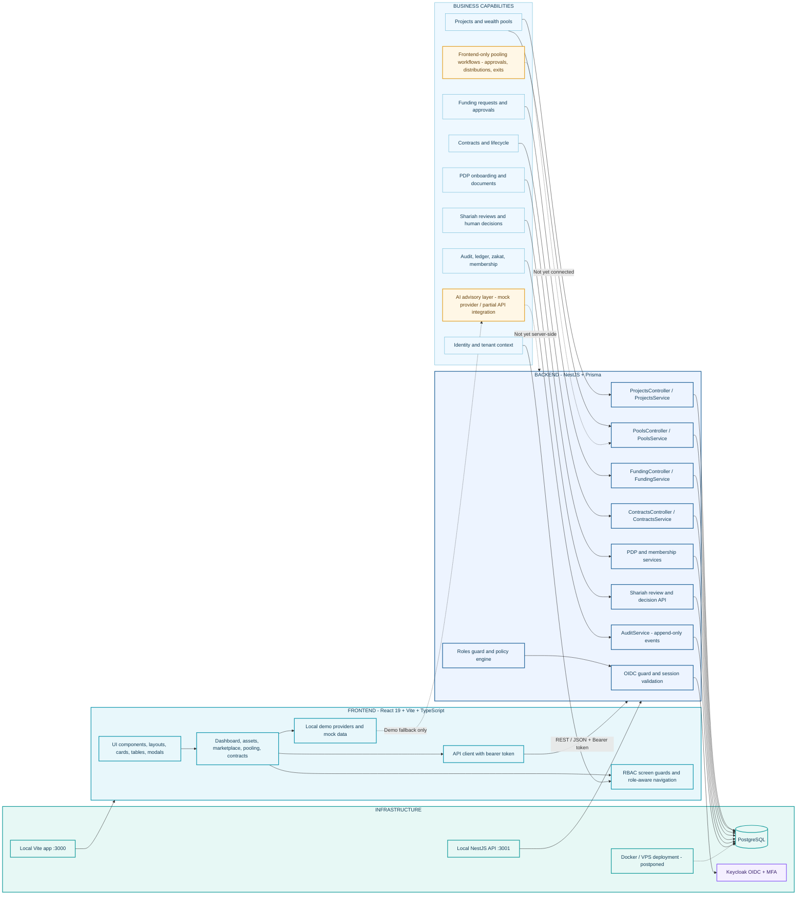

# Wealth Pooling Application Architecture

This diagram reflects the current repository architecture. It intentionally
does not show Laravel, Inertia, or shared backend/frontend domain modules,
because the current implementation uses React/Vite and NestJS/Prisma.

## Current Layer Responsibilities

| Layer | Current implementation | Status |
|---|---|---|
| Frontend | React 19, Vite, TypeScript, Tailwind CSS, local RBAC UX | Implemented prototype |
| Business capabilities | Dashboard, assets, contracts, PDP, project/pool foundation, Shariah review foundation | Mixed: partial backend and frontend mock workflows |
| Backend | NestJS controllers/services, Prisma ORM, PostgreSQL persistence, policy and audit services | Foundation implemented |
| Identity | Keycloak OIDC, PKCE, MFA claims, server-side role mapping | Production integration prepared; live deployment pending |
| Shariah backend | Persisted reviews and human decisions with tenant/RBAC/audit controls | Implemented foundation |
| AI layer | Frontend mock provider, local governance/audit state, Shariah API review creation/decision integration | AI analysis backend pending |
| Pooling | Backend project/pool/funding foundation; frontend approval/distribution/exit mock services | Partial |
| Infrastructure | Local PostgreSQL and local API/frontend; VPS/Docker deployment postponed | Development-ready, production pending |

## Important Boundaries

- The frontend communicates with the backend through REST/JSON; it is not an Inertia application.
- The backend is authoritative for authentication, authorization, tenant scope, persistence, and audit events.
- Frontend RBAC controls visibility only and must not be treated as a security boundary.
- AI output is advisory and cannot approve contracts, activate pools, or execute transactions.
- The current AI provider is a mock provider; a server-side AI gateway is still required.
- The current frontend pooling approval, distribution, exit, and secondary-market flows are not yet connected to backend persistence.
- Docker/VPS deployment remains postponed while local PostgreSQL is used for development.
