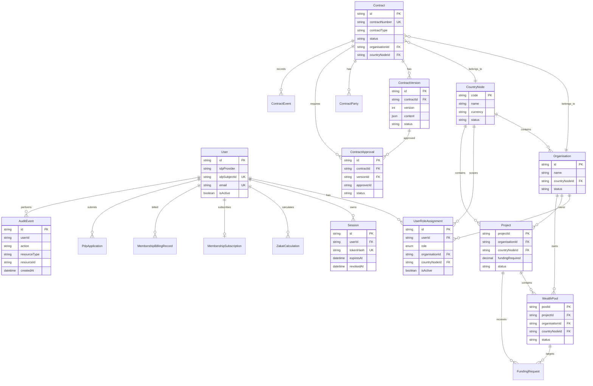

# Wealth Pooling Project Documentation

## 1. Project Overview

Wealth Pooling is a multi-tenant Islamic circular-economy platform for
country nodes, organisations, project sponsors, asset owners, investors,
financial operations, Shariah governance, and auditability.

The current repository is an MVP prototype using React/Vite for the frontend
and NestJS/Prisma/PostgreSQL for the backend. Keycloak is the selected identity
provider for production authentication and MFA.

The current implementation is not Laravel/Inertia. The implemented stack is:

```text
React + Vite + TypeScript
        |
        | REST/JSON API
        v
NestJS + Prisma
        |
        v
PostgreSQL

Browser authentication → Keycloak OIDC + PKCE + MFA
```

## 2. Architecture

See the visual architecture diagram and current layer responsibilities in
[`CURRENT_ARCHITECTURE.md`](CURRENT_ARCHITECTURE.md).

### 2.1 High-Level Architecture

```text
User Browser
    |
    | OIDC Authorization Code + PKCE
    v
Keycloak
    |  Password, MFA, user identity, SSO
    |
    | Access token
    v
React/Vite Frontend
    |
    | Bearer access token / REST API
    v
NestJS API
    | Authentication and MFA claim validation
    | Server-side RBAC and tenant isolation
    | Contract and workflow services
    | Audit recording
    v
PostgreSQL
    | Application data
    | Sessions
    | Contract history
    | Audit events
```

### 2.2 Low-Level Request Flow

```text
1. User selects Sign In.
2. Frontend creates PKCE verifier and state.
3. Frontend redirects to Keycloak.
4. Keycloak verifies password and MFA policy.
5. Keycloak redirects to the frontend with an authorization code.
6. Frontend exchanges the code for an access token.
7. Frontend calls /users/me and /users/me/access.
8. Backend verifies issuer, audience, expiry, signature, and MFA claim.
9. Backend finds the local user using Keycloak subject ID.
10. Backend resolves active role and tenant assignment from PostgreSQL.
11. Backend creates or validates the hashed session record.
12. Frontend renders only the permitted role screens.
```

### 2.3 Technology Stack

| Area | Technology |
|---|---|
| Frontend | React 19, Vite, TypeScript |
| Styling | Tailwind CSS, CSS |
| UI icons/animation | Lucide React, Motion |
| Backend | NestJS, TypeScript |
| API | REST/JSON |
| ORM | Prisma |
| Database | PostgreSQL |
| Identity | Keycloak OIDC |
| Authentication | Authorization Code + PKCE |
| MFA | Keycloak OTP/WebAuthn |
| Testing | Jest, ts-jest |
| Local containers | Docker Compose |
| Database client | DBeaver through SSH tunnel |

### 2.4 ERD



## 3. Objective

- Provide a secure multi-tenant platform for Islamic wealth and project
  participation.
- Separate authentication identity from application authorization.
- Enforce role-based screen and API access.
- Enforce country-node and organisation tenant boundaries.
- Provide traceable contract, approval, and lifecycle events.
- Establish a reliable foundation for investments, wallets, ledger, Shariah,
  compliance, and financial integrity modules.
- Prepare the platform for controlled MVP launch and later production scale.

## 4. Scope

### 4.1 Current Foundation Scope

- Keycloak OIDC authentication and MFA integration
- User identity mapping
- User role assignments
- Country node and organisation scoping
- Server-side RBAC policy engine
- Frontend persona and screen visibility
- PostgreSQL schema and Prisma migrations
- Project, wealth pool, and funding request foundation
- Contract foundation and lifecycle API
- Persistent sessions and logout revocation
- Append-only audit events
- PDP onboarding
- Membership and zakat calculation foundations

### 4.2 MVP Scope

- Complete Users and RBAC administration
- Complete contract creation and approval flow
- Asset registration and verification
- Basic project and pool discovery
- Investor entry points
- Basic portfolio and investment positions
- Wallet and ledger foundations
- Shariah approval workflow
- Financial and audit reporting
- Notifications and operational dashboards

### 4.3 Later Scope

- Full Mudarabah and Musharakah calculation engines
- Profit and loss distribution
- Default, recovery, write-off, and negligence workflows
- KYC/KYB/AML integrations
- Payment gateway integration
- Production-grade document storage
- High availability and horizontal scaling
- Advanced analytics and AI governance

## 5. Timeline

| Phase | Target work | Status |
|---|---|---|
| Mockup/Wireframe | UI concepts, personas, navigation, dashboards, landing page | Completed prototype |
| Month 1: Foundation | Identity, RBAC, tenant model, PostgreSQL, audit, contract foundation | In progress / mostly implemented |
| Month 2: Assets and onboarding | PDP workflow, asset register, verification, documents | Partial foundation |
| Month 3: Pooling and investments | Project/pool operations, participants, investment entry, portfolio | Planned/partial mockup |
| Month 4: Contracts | Mudarabah/Musharakah, parties, capital, approval, signatures, activation | Foundation API exists; business rules remain |
| Month 5: Financial integrity | Wallet, ledger, profit distribution, zakat, audit, notifications | Planned/partial mockup |
| Month 6: MVP stabilisation | E2E testing, security testing, performance, UAT, bug fixing, deployment | Not complete |
| Target launch | HTTPS, persistent Keycloak/PostgreSQL, monitoring, backups, UAT approval | Future target |

## 6. Ordered Tasks and Backlog

### 6.1 Immediate Tasks

1. Run PostgreSQL and Keycloak with persistent storage.
2. Confirm OIDC issuer, audience, JWKS, and redirect URI.
3. Link synthetic Keycloak users to HOW `idpSubjectId` records.
4. Complete session refresh, expiry, revocation, and Keycloak logout.
5. Confirm MFA `amr` claim enforcement for sensitive roles.
6. Complete Users and RBAC CRUD APIs.
7. Test every persona against the screen matrix.
8. Complete contract approval and lifecycle rules.
9. Add real HTTP integration tests.
10. Add database backup and deployment documentation.

### 6.2 Known Backlog, Errors, and Solutions

| Problem | Likely cause | Solution |
|---|---|---|
| Backend health refuses connection | NestJS API is not running on port 3001 | Run `npm --prefix server run start:dev` and test `/health` |
| Keycloak says HTTPS required | Public IP and `master` realm use HTTP | Use SSH tunnel for admin or configure HTTPS |
| Keycloak issuer mismatch | Hostname differs between browser and backend | Use the exact issuer from discovery metadata |
| API returns 401 after Keycloak login | User subject, tenant, role, audience, or MFA claim mismatch | Check backend logs and database mapping |
| All users return to public page | Frontend cannot reach API or backend identity check failed | Check `/users/me`, `/users/me/access`, and `VITE_API_BASE_URL` |
| DBeaver SSH error | SSH password and PostgreSQL password confused | Use VPS password in SSH tab and database password in Main tab |
| `pg_restore` version error | Restore client is older than dump client | Use matching or newer PostgreSQL client |
| PostgreSQL permission denied for dump | `postgres` cannot read `/root` files | Copy dump to `/tmp` and change ownership |
| OTP is not requested again | OTP configured but Browser Flow is not bound/enforced | Configure and bind the correct Browser Flow |
| Prisma engine EPERM on Windows | Backend process locks query engine | Stop Node/backend process and rerun `prisma generate` |

### 6.3 Deferred Items

- Redis
- Real production users
- Public HTTP production deployment
- Full financial ledger implementation
- Full Laravel/Inertia conversion

## 7. Users and Role-Based Access Control

### 7.1 Authorization Rules

- Keycloak authenticates the user.
- HOW PostgreSQL is authoritative for application roles.
- A role is active only when its assignment is active.
- Non-Super Admin users are restricted by country node and organisation.
- The frontend hides unavailable screens, but the backend always enforces
  authorization independently.
- Production users cannot switch to demo personas.

### 7.2 Required User CRUD

The complete Users module must support:

| Operation | Endpoint | Requirement |
|---|---|---|
| Create | `POST /users` | Provision identity link and profile; no arbitrary role escalation |
| Read list | `GET /users` | Tenant-scoped list |
| Read one | `GET /users/:userId` | Tenant-scoped detail |
| Read current | `GET /users/me` | Current authenticated user only |
| Update | `PATCH /users/:userId` | Validated profile/status update |
| Delete/deactivate | `DELETE /users/:userId` | Prefer soft deactivation and audit |
| Update status | `PATCH /users/:userId/status` | Valid status transition and tenant check |

Current implementation includes `GET /users`, `GET /users/me`, status update,
role assignment, role revocation, and role listing. Full create, read-one,
profile update, and delete/deactivate endpoints remain required for complete
CRUD.

### 7.3 Required Role CRUD

| Operation | Endpoint | Requirement |
|---|---|---|
| Assign | `POST /users/:userId/roles` | Super Admin/Country Admin policy and tenant scope |
| Read | `GET /users/:userId/roles` | Tenant-scoped role listing |
| Update | Revoke and reassign | Preserve role history and audit trail |
| Delete | `DELETE /users/:userId/roles/:role/orgs/:organisationId/countries/:countryNodeId` | Soft revoke, never erase history |

Privileged roles must only be assigned or revoked by a Super Admin. Every role
mutation must create an audit event.

### 7.4 Role-to-Screen Behaviour

The frontend must use the active backend role and `accessibleTabs` matrix. For
every role:

1. Display only permitted navigation tabs.
2. Protect direct tab navigation with a role guard.
3. Hide create/update/approve actions without the required permission.
4. Show access denied for unauthorized direct access.
5. Keep backend API authorization as the final security boundary.

## 8. Manual: How to Use the System

### 8.1 Start Backend

```powershell
cd C:\clone_how\mockup-house-of-wealth
npm --prefix server run start:dev
```

Open:

```text
http://localhost:3001/health
```

The response must include:

```json
{
  "status": "ok"
}
```

### 8.2 Start Frontend

```powershell
npm run dev
```

Open:

```text
http://localhost:3000
```

### 8.3 Start Keycloak

On the VPS:

```bash
cd /root/keycloak
docker compose ps
docker compose up -d
```

Verify the issuer:

```bash
curl -s http://127.0.0.1:8080/realms/house-of-wealth/.well-known/openid-configuration
```

### 8.4 Login

```text
Application → Keycloak password → MFA if required → callback → dashboard
```

After login, verify the profile displays the backend user and the correct
active role. If it returns to the public page, check `/health`, backend logs,
and browser DevTools Network requests for `/users/me` and `/users/me/access`.

### 8.5 DBeaver PostgreSQL Access

Use an SSH tunnel and never expose port `5432` publicly.

```text
SSH host: 45.127.7.141
SSH port: 8288
SSH user: howadmin
Local port: 15433
Remote host: 127.0.0.1
Remote port: 5432
```

PostgreSQL connection:

```text
Host: localhost
Port: 15433
Database: house_of_wealth
Username: how_app or postgres
Password: PostgreSQL password
```

### 8.6 Contract API Quick Reference

```text
GET  /contracts
GET  /contracts/:id
POST /contracts
POST /contracts/:id/versions
POST /contracts/:id/parties
POST /contracts/:id/approvals
POST /contracts/:id/approvals/:approvalId
POST /contracts/:id/transition
```

Valid initial lifecycle:

```text
DRAFT → PENDING_APPROVAL → APPROVED → SIGNED → ACTIVE
```

### 8.7 Validation Commands

```powershell
npm run lint
npm run build
npm --prefix server run typecheck
npm --prefix server test -- --runInBand
```

Expected current backend test result:

```text
7 test suites passed
40 tests passed
```

## 9. Current Readiness

### Ready for Development/UAT

- Frontend prototype
- Keycloak development setup
- OIDC PKCE login adapter
- Server-side role and tenant checks
- PostgreSQL schema foundation
- Contract API foundation
- Audit and session foundation

### Not Yet Production Ready

- HTTP is still used in the development VPS setup.
- Keycloak must use persistent PostgreSQL storage.
- Token refresh is not complete.
- Full Users CRUD is not complete.
- Contract approval and signature integrity rules need strengthening.
- True Keycloak/PostgreSQL end-to-end tests are still required.
- Backups, monitoring, rate limiting, and deployment automation are pending.

## 11. Demo Readiness

### 11.1 Guided Demo Status

The local guided demo path is **100% ready** as of 2026-09-18.

Validated prerequisites:

- Frontend available at `http://localhost:3000`.
- Backend available at `http://localhost:3001`.
- `GET /health` returns `200 OK`.
- PostgreSQL `house_of_wealth_local` is reachable.
- All eight Prisma migrations are applied.
- Mock seed data is loaded, including users, roles, organisations, projects,
  pools, and funding records.
- Shariah review creation and human decision endpoints were smoke-tested with
  the local mock Super Admin identity.

Validated walkthrough areas:

- Mock login and role-based dashboard entry.
- Dashboard, navigation, and responsive frontend rendering.
- Asset registration, ownership deed/photo selection, larger image preview,
  and multi-photo asset detail gallery.
- Contract wizard, signature confirmation, and pending contract submission.
- Shariah review creation and persisted human decision submission.
- Audit and ledger CSV export.
- Contract performance audit print/save flow.
- PDP application document download controls.
- Sponsor data-room download controls.
- Admin Center module availability controls, including server-enforced disablement
  for Shariah governance and wealth pooling routes.
- KYC and KYB module modes support `ACTIVE`, `MANUAL_REVIEW`, and `DISABLED`.
  KYB manual review is persisted through the PDP application workflow and
  requires an authorised reviewer justification; KYC remains a frontend demo
  queue until a persisted individual-verification submission API is added.
- Frontend lint, production build, backend typecheck, backend build, and
  backend unit tests.

### 11.2 Demo Start Commands

```powershell
npm --prefix server run start:dev
npm run dev
```

If the local database is recreated, restore demo readiness with:

```powershell
npm --prefix server exec prisma migrate deploy
npm --prefix server run db:seed
```

### 11.3 Module Availability Controls

Super Admin, AI Administrator, and Security Administrator users can manage
module availability from **Admin Center > System & Organization > Module
Availability**. Status is stored in PostgreSQL (`FeatureModule`), changes are
written to the append-only audit log, and disabled Shariah or wealth-pooling
requests return `503 Service Unavailable` from the backend. The financial ledger
is intentionally non-disableable because audit and governance controls must
remain available.

KYC/KYB readiness is configured independently. `MANUAL_REVIEW` keeps
submissions open but records them as `PENDING_MANUAL_REVIEW`; KYB reviewers use
`POST /pdp/applications/:id/kyb-review` with an approval decision and
justification. This does not represent automated identity verification.

### 11.4 Runtime Readiness Modes

The frontend supports three explicit runtime modes:

- `DEMO`: local/mock authentication and demo workflows.
- `PRE_PRODUCTION`: real API and PostgreSQL preview with mock authentication;
  MFA is intentionally not challenged and is visibly marked as not configured.
- `PRODUCTION`: real identity provider flow with MFA and production security
  controls required.

`PRE_PRODUCTION` must not be treated as a production deployment or used for
real customer transactions. It exists to exercise the complete application
against backend services while integrations such as MFA remain unfinished.

### 11.5 AI Backend Foundation

The backend AI foundation is available under `/ai` and is protected by the
`AI_INTELLIGENCE` feature module:

- `POST /ai/chat`
- `POST /ai/contract-advisor/analyze`
- `POST /ai/contract-drafts/generate`
- `POST /ai/shariah/analyze`
- `POST /ai/due-diligence/analyze`
- `POST /ai/decisions/:id/review`
- `POST /ai/rag/documents`
- `POST /ai/rag/documents/search`
- `GET /ai/conversations/:id`

Conversation messages, AI runs, human decisions, RAG documents, and chunks are
persisted in PostgreSQL. Tenant scope is applied using the authenticated
organisation and country node, and request/response/decision/RAG operations are
written to the audit log. The current provider is deliberately a low-confidence
`sandbox` adapter; a real model provider must be configured before production
use. PostgreSQL runs with the `pgvector/pgvector:pg16` image and the migration
creates the vector extension and embedding index. Embedding generation is still
an integration task; keyword search remains available as a safe fallback.

The current demo uses mock data and simulated AI/payment behavior in several
screens. This does not mean those areas are production-ready; it means the
defined presentation workflow is complete and repeatable.

## 10. Backend Process Audit: Shariah, Wealth Pooling, and AI Intelligence

Audit date: 2026-09-15.

This audit separates backend functionality from frontend demonstrations. A
button or frontend service is not considered backend functionality unless it
calls a server endpoint and the result is persisted in PostgreSQL.

### 10.1 Executive Status Matrix

| Area | Backend status | Persistence | Frontend integration | Readiness |
|---|---|---|---|---|
| Shariah review and signoff | Review/decision API implemented; AI analysis endpoint still absent | PostgreSQL `ShariahReview` and `ShariahDecision` | Audit creation and human decisions call the API; advisory result remains mock | Partial foundation |
| Shariah governance content | No live content API | LocalStorage in demo mode; production branch logs to console | Frontend service | Prototype/partial |
| Wealth pool foundation | Projects, pools, and funding APIs exist | PostgreSQL models and audit events | Frontend pooling uses separate in-memory service | Partial foundation |
| Pool governance approvals | No backend pool approval/open endpoints | Frontend memory only | Client-side four-step approval | Not production ready |
| Pool investments and exits | No backend endpoints/models | None | Mock data and local handlers | Prototype only |
| AI analysis | No AI backend module or endpoint | None | Mock provider and local orchestrator | Prototype only |
| AI audit and human decisions | No server AI audit API/model | In-memory browser state | Local `AIAuditLogger` | Not production ready |
| AI credits and monetisation | No backend credit or billing API | Frontend service/revenue state | Simulated balance and payment | Prototype only |

### 10.2 Shariah Layer Findings

The frontend Shariah workflow is implemented in:

- `src/shariah/shariahService.ts`
- `src/shariah/shariahContentService.ts`
- `src/ai/features/shariah/AIShariahAssistant.tsx`

The review records are initialized in memory from mock data. Approval writes a
frontend audit event and notification only. The public Shariah content manager
uses LocalStorage in DEMO mode. Its PRODUCTION path currently writes an
informational console message rather than making an HTTP request.

The `AIShariahAssistant` advisory result is still local: the findings and
confidence score are hardcoded. The audit action now creates a persisted
Shariah review through the backend, and the human signoff panel submits its
decision to the persisted decision endpoint. The AI analysis itself is not yet
server-generated.

The backend Shariah foundation is now implemented in:

- `server/src/shariah/shariah.module.ts`
- `server/src/shariah/shariah.controller.ts`
- `server/src/shariah/shariah.service.ts`
- `server/src/shariah/shariah.dto.ts`
- `server/prisma/schema.prisma` (`ShariahReview`, `ShariahDecision`)

Available routes:

```text
GET  /shariah/reviews
GET  /shariah/reviews/:id
POST /shariah/reviews
POST /shariah/reviews/:id/decisions
```

The routes enforce governance permissions, allowed reviewer roles, tenant
scope, justification for modified/overridden decisions, and append an
`AuditEvent`. Shariah roles are included in the backend MFA-required role set.
Accepted decisions become `APPROVED`; no endpoint activates a contract or
executes a transaction.

Still missing are the AI analysis endpoint, AAOIFI standards registry, fatwa
reference records, and evidence/document links. Existing
backend PDP compliance declarations and the `proposedShariahContract` project
field remain separate from the Shariah review workflow.

### 10.3 Wealth Pooling Findings

The backend pooling foundation is implemented in:

- `server/src/projects/projects.controller.ts`
- `server/src/projects/projects.service.ts`
- `server/src/pools/pools.controller.ts`
- `server/src/pools/pools.service.ts`
- `server/src/funding/funding.controller.ts`
- `server/src/funding/funding.service.ts`
- `server/prisma/schema.prisma` (`Project`, `WealthPool`, `FundingRequest`)

Available backend routes:

```text
GET  /projects
GET  /projects/:id
POST /projects
GET  /pools
GET  /pools/:id
POST /pools
POST /funding/projects/:projectId/requests
GET  /funding/requests/:projectId
POST /funding/requests/:requestId/approve
POST /funding/requests/:requestId/disburse
```

These routes use PostgreSQL, tenant scope checks, server-side policy checks,
and audit events. The current tests cover the project/funding/policy foundation.

The frontend does not consume these routes. Instead,
`src/pooling/poolService.ts` stores pools in an in-memory array and implements
pool creation, four approval flags, marketplace opening, notifications, and
frontend audit logging locally.

Missing backend pooling capabilities include pool approval and opening
workflows, participant/investment records, profit distributions, capital
calls, exit requests, secondary-market orders, and settlement. The pool create
DTO is also an interface without class-validator rules, so request validation
needs strengthening before production use.

### 10.4 AI Intelligence Layer Findings

The AI layer is implemented only on the frontend:

- `src/ai/services/AIProvider.ts` uses `MockAIProvider`.
- `src/ai/services/AIOrchestrator.ts` runs in the browser.
- `src/ai/services/AIService.ts` builds local mock recommendations.
- `src/ai/services/AIAuditLogger.ts` stores events in an in-memory array.
- `src/ai/services/AIGovernanceService.ts` stores feature settings in memory.
- `src/ai/monetisation/aiMonetisationService.ts` simulates credits and payment.

Some AI screens use a timer and hardcoded data without even calling the local
orchestrator. No AI request, response, prompt/context, model version,
confidence result, human decision, credit deduction, or payment record is
sent to the NestJS backend or persisted in PostgreSQL.

The backend `app.module.ts` has no AI module. There are no AI request, AI
response, AI governance, AI usage, AI credit, or AI human-decision models.

### 10.5 Verification Performed

The following checks passed on 2026-09-15:

```text
Frontend: npm run lint       PASS
Frontend: npm run build      PASS
Backend:  npm run typecheck  PASS
Backend:  npm run build      PASS
Backend:  npm test -- --runInBand
          8 test suites passed
          44 tests passed
```

These checks confirm compilation and unit-level foundation behavior. They do
not prove live PostgreSQL HTTP integration for Shariah, pooling frontend
flows, or AI operations because those integrations do not currently exist.

### 10.6 Required Backend Implementation Order

1. Add Shariah standards, fatwa reference, evidence, and reviewer assignment
   models around the implemented review and decision foundation.
2. Add the Shariah AI analysis endpoint and persist provider output separately
   from the human decision.
3. Connect `AIShariahAssistant` and the human signoff UI to `/shariah/reviews`
   and `/shariah/reviews/:id/decisions`.
4. Connect frontend pool reads and writes to `/projects`, `/pools`, and
   `/funding`; remove the parallel in-memory pool service in production mode.
5. Add persistent pool approvals, subscriptions, distributions, exits,
   secondary-market orders, and settlement workflows.
6. Add an AI gateway module with provider abstraction, request validation,
   model configuration, usage limits, redacted context storage, and audit
   persistence.
7. Add server-side AI credit ledger and billing integration; never trust a
   browser-maintained balance for deductions.
8. Add HTTP integration tests covering tenant isolation, role permissions,
   human signoff, idempotency, insufficient credits, and failure recovery.
